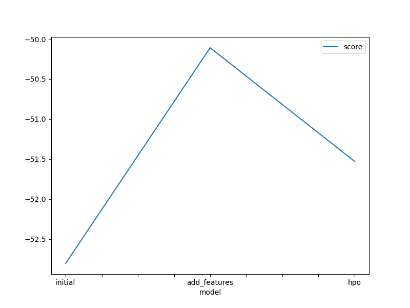
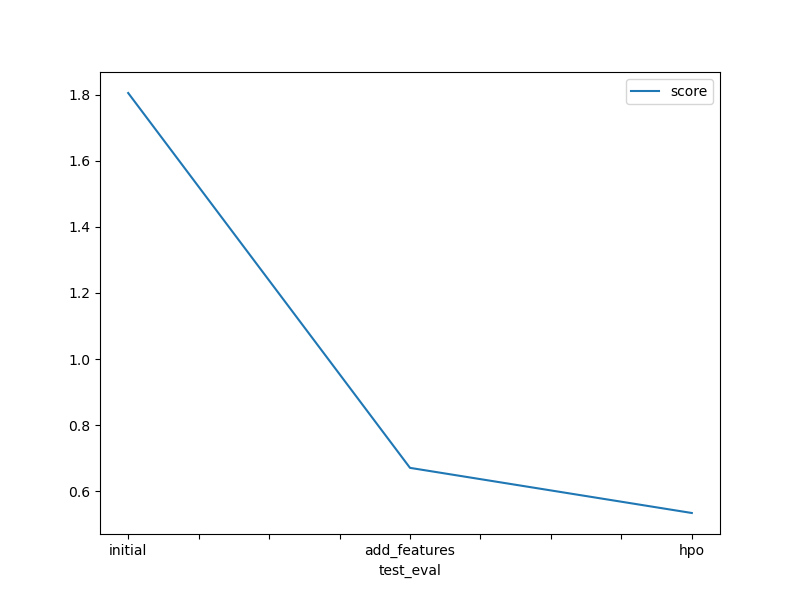

# Report: Predict Bike Sharing Demand with AutoGluon Solution
#### Zuber JAFFAR

## Initial Training
### What did you realize when you tried to submit your predictions? What changes were needed to the output of the predictor to submit your results?
The initial predicyion was supposed to yield negative values. However no such result was observed (min = 3.308210).
Therefore, forcing any negative value to ZERO was not required.

### What was the top ranked model that performed?
WeightedEnsemble_L3 was the best performing model with a score of -52.80.

## Exploratory data analysis and feature creation
### What did the exploratory analysis find and how did you add additional features?
From the datetime feature was used to extract `hour` as the feature. `astype("datetime64").dt.hour` was used to add the feature for each of the dataframes.
The `minute` and `seconds` potential features well are with uique values (0), hence have no bearing on the predictions.
`atemp` and `temp` have strong correlation (0.97), hence no significant on the results of the predicitions.

### How much better did your model preform after adding additional features and why do you think that is?
This model performed better (score = -50.10) than the initial model without feature engineering (score = -52.80).
Reasons:
- Splitting the initial `datetime` feature into only relevant feature (`hour`)
- Removing a feature with strong correlation (`atemp`) in addition to dropping `casual` and `registered` features
- Converting `integer` types to `category` for some features (`season` and `weather`)

## Hyper parameter tuning
### How much better did your model preform after trying different hyper parameters?
Tuning hyperparameters did not yield much better results than the 'add features' step.

### If you were given more time with this dataset, where do you think you would spend more time?
Studying further this dataset by tuning other hyperparameters. FOr exmaple, increasing the number of trials or allowing the model to train longer.

### Create a table with the models you ran, the hyperparameters modified, and the kaggle score.
| model | hpo1 | hpo2 |	hpo3 | score |
|--|--|--|--|--|
| initial |	presets="best_quality" | Automatic settings | Automatic settings | 1.804880 |
| add_features | presets="best_quality" | Automatic settings | Automatic settings | 0.670830 |
| hpo |	presets="best_quality" | GBM/RF/XT/XGB models |	search_trategy: bayesopt |	0.534272 |

### Create a line plot showing the top model score for the three (or more) training runs during the project.

TODO: Replace the image below with your own.

### Create a line plot showing the top kaggle score for the three (or more) prediction submissions during the project.

TODO: Replace the image below with your own.

## Summary
- The AutoGluon AutoML framework for Tabular Data was applied to the  bike sharing demand prediction dataset to predict utilisarion.
- Exploratory data analysis (EDA) was performed followed by prediction with feature engineering (without hyperparameter optimization).
- Last step consisted in hyperparameter tuning and model selection.
- While tuning of hyperparemeters was explored, performance did not improve compared to the resuls obtain after fearure engineering step without tuning.
- Further investigations could be pursued in an attempt to find optimal hyperparameters settings for improved results and balance such configurations with the cost (usage of resources) of training and testing.

